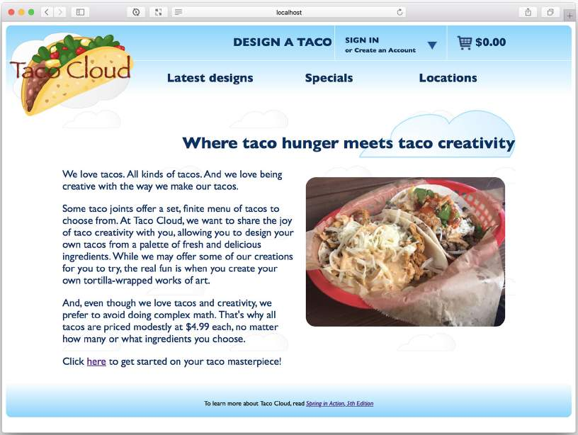

# 6.1 编写 RESTful 控制器

当翻页并阅读本章的介绍时，Taco Cloud 的用户界面已经被重新设计了。一直在做的事情在开始的时候是可以的，但是在美学方面却有欠缺。

图 6.1 只是新的 Taco Cloud 的一个示例，很时髦的，不是吗？

在我对 Taco Cloud 外观进行改进的同时，我还决定使用流行的 Angular 框架将前端构建为一个单页应用程序。最终，这个新的浏览器 UI 将取代在第 2 章中创建的服务器渲染页面。但要实现这一点，需要创建一个 REST API，基于 Angular 的 UI 将与之通信，以保存和获取 taco 数据。

> 用 SPA 还是不用？
>
> 在第 2 章中，使用 Spring MVC 开发了一个传统的多页面应用程序（MPA），现在将用一个基于 Angular 的单页面应用程序（SPA）取代它，但并不总是说 SPA 是比 MPA 更好的选择。
>
> 由于呈现在很大程度上与 SPA 中的后端处理解耦，因此可以为相同的后端功能开发多个用户界面（例如本机移动应用程序）。它还提供了与其他可以使用 API 的应用程序集成的机会。但并不是所有的应用程序都需要这种灵活性，如果只需要在 web 页面上显示信息，那么 MPA 是一种更简单的设计。

这不是一本关于 Angular 的书，所以这一章的代码主要着重于后端的 Spring 代码。我将展示足够多的 Angular 代码，让你了解客户端是如何工作的。请放心，完整的代码集，包括 Angular 前端，都可以作为可下载代码的一部分，在 [https://github.com/habuma/springing-inaction-5-samples](https://github.com/habuma/springing-inaction-5-samples) 中找到。你可能还会对 Jeremy Wilken（2018 年传）的《Angular 实战》以及 Yakov Fain 和 Anton Moiseev（2018 年出版）合著的《基于 TypeScript 的 Angular 开发（第二版）》感兴趣。

简而言之，Angular 客户端代码将通过 HTTP 请求的方式与本章中创建的 API 进行通信。在第 2 章中，使用 @GetMapping 和 @PostMapping 注解来获取和发送数据到服务器。在定义 REST API 时，这些相同的注释仍然很有用。此外，Spring MVC 还为各种类型的 HTTP 请求支持少量其他注解，如表 6.1 所示。

**表 6.1 Spring MVC HTTP 请求处理注解**

| 注解 | HTTP 方法 | 典型用法 |
| :--- | :--- | :--- |
| @GetMapping | HTTP GET 请求 | 读取资源数据 |
| @PostMapping | HTTP POST 请求 | 创建资源 |
| @PutMapping | HTTP PUT 请求 | 更新资源 |
| @PatchMapping | HTTP PATCH 请求 | 更新资源 |
| @DeleteMapping | HTTP DELETE 请求 | 删除资源 |
| @RequestMapping | 通用请求处理 |  |

要查看这些注释的实际效果，将首先创建一个简单的 REST 端点，该端点获取一些最近创建的 taco。

